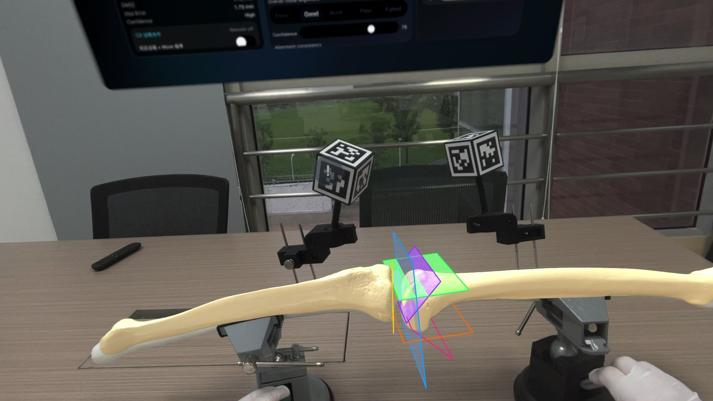

# OrthoReg-World

Mixed-reality orthopaedic registration and TKA navigation on Apple Vision Pro

[中文说明](README_CN.md)


[](https://youtu.be/YVuVoCD0BBM)

## Overview

**OrthoReg-World** is a research prototype that explores mixed-reality
orthopaedic registration and total knee arthroplasty (TKA) navigation on Apple
Vision Pro.

The demonstrated workflow registers the tibia and femur into a shared spatial
context and then visualizes planned virtual resection planes at the navigation
endpoint. The current system is evaluated with orthopaedic phantoms in a
non-clinical environment.

This repository is the public project page and data release. It is deliberately
separated from the private application repository.

## Video demonstration

The recorded demonstration covers:

1. tibial registration;
2. femoral registration;
3. spatial presentation of the registered anatomy; and
4. virtual TKA cut-plane visualization.

▶ **[Watch the complete demonstration on YouTube](https://youtu.be/YVuVoCD0BBM)**

## Research workflow

```text
Research case and planned geometry
                │
                ▼
        Tibia registration
                │
                ▼
        Femur registration
                │
                ▼
   Registered spatial coordinate context
                │
                ▼
      Virtual TKA cut-plane display
```

The public description intentionally remains implementation-agnostic. It
documents the research question, observable workflow, experimental design, and
analysis-ready data without exposing proprietary application components.

## What is public

- Project motivation and high-level workflow
- A recorded Vision Pro phantom demonstration
- De-identified run-level and point-level experimental data
- Public workflow events and aggregated quality-warning records
- Data dictionary and pseudonymous device mapping
- Protocol summaries, effect estimates, and data-quality audit outputs
- A dependency-free script that verifies the released data

## What is not public

- The complete Vision Pro application source code
- Proprietary registration and navigation modules
- Enterprise API integrations or service implementation details
- Credentials, internal endpoints, device serial numbers, or private logs
- Non-public models, development datasets, or internal evaluation artifacts
- Raw image/video exports that have not completed visual privacy review

## Open experimental data

The repository includes an analysis-ready release from a prospective, balanced
phantom comparison of an **Adaptive** acquisition protocol and a **Fixed k=10**
control protocol.

### Experimental design

| Item | Released cohort |
| --- | ---: |
| Completed formal runs | 36 |
| Adaptive / Fixed k=10 | 18 / 18 |
| Pseudonymous operators | 3 |
| Pseudonymous Vision Pro devices | 2 |
| Anatomies | Tibia and Femur |
| Held-out TRE groups | 3 |
| Held-out TRE points per run | 7 |
| Total held-out TRE observations | 252 |

The design was prospective and balanced, but no random-allocation record exists.
It must not be interpreted or cited as a randomized trial. The primary analysis
unit is one completed run; the 252 point-level observations are not 252
independent experiments.

### Headline phantom results

| Run-level outcome | Adaptive (n=18) | Fixed k=10 (n=18) |
| --- | ---: | ---: |
| RMS TRE across 7 held-out targets, mean ± SD across runs | 1.008 ± 0.111 mm | 2.458 ± 0.438 mm |
| All 7 TRE points ≤3 mm | 18/18 runs | 3/18 runs |

For each run, the reported RMS TRE is
`sqrt((TRE₁² + ... + TRE₇²) / 7)`, where each TRE is the Euclidean target
registration error at one held-out landmark. It is not the registration-point
fit RMSE.

The adjusted Adaptive-minus-Fixed run-level RMS TRE estimate was **−1.450 mm** with an
HC3 95% confidence interval of **−1.682 to −1.218 mm**. These results support a
phantom accuracy and reliability difference under the tested protocol. They do
not demonstrate clinical effectiveness or generalization to patients.

Full definitions and supporting values are available in
[`docs/open-data-summary.md`](docs/open-data-summary.md) and
[`metadata/data_dictionary.csv`](metadata/data_dictionary.csv).

## Repository structure

```text
.
├── README.md
├── README_CN.md
├── LICENSE
├── MANIFEST_SHA256.txt
├── assets/
│   └── demo-overview.jpg
├── data/
│   ├── run_level_public.csv
│   ├── tre_point_level_public.csv
│   ├── workflow_events_public.csv
│   └── quality_warnings_public.csv
├── analysis/
│   ├── summary_by_protocol.csv
│   ├── metric_effects.csv
│   ├── threshold_reliability.csv
│   ├── adjusted_ols_hc3.csv
│   ├── design_balance_recomputed.csv
│   ├── data_quality_audit_source.csv
│   └── reproduced_headline_statistics.json
├── metadata/
│   ├── data_dictionary.csv
│   ├── device_mapping.csv
│   ├── excluded_preliminary_exports.csv
│   └── prepublic_security_scan.csv
├── docs/
│   ├── open-data-summary.md
│   └── data-availability-statement.txt
└── scripts/
    └── validate_open_data.py
```

## Validate the release

The validation script uses only the Python standard library:

```bash
python3 scripts/validate_open_data.py
```

It checks:

- expected file and row counts;
- run and package identifier uniqueness;
- protocol, operator, device, anatomy, and TRE-group balance;
- seven held-out TRE observations per run;
- cross-file run coverage and exact duplicate rows;
- agreement with the released headline statistics; and
- common public-release risks such as local paths, email addresses, URLs,
  private network addresses, and credential-like assignments.

Release file integrity can be checked with:

```bash
shasum -a 256 -c MANIFEST_SHA256.txt
```

## Data-quality and privacy status

- All 36 planned formal packages matched one-to-one to complete exports.
- Protocol, anatomy, and TRE-group mismatches were zero.
- Transform-freeze records were present before held-out TRE for all 36 runs.
- The two model-off preliminary exports are documented separately and excluded.
- Operators and devices use pseudonymous identifiers.
- No patient data were collected; all released observations are phantom data.
- The source-faithful workflow-event table retains one exact duplicated planning
  event. Deduplicate exact rows before event-frequency analysis.

The raw experimental archives are not included. Although their text content
passed a pre-publication scan, their saved visual frames may show the laboratory,
operator hands, or computer displays and therefore require separate manual
review.

## License and citation

The public contents of this repository—including the released experimental
data, documentation, analysis outputs, demonstration image, and validation
code—are licensed under the
[Creative Commons Attribution 4.0 International License](LICENSE).

When reusing the material, cite **“OrthoReg-World project and 36-run phantom
comparison dataset,”** link to this repository and the CC BY 4.0 license, and
indicate whether changes were made.

The license does not cover the private OrthoReg application, enterprise
integrations, proprietary modules, raw exports, or any other material not
included in this repository.

Citation metadata and the associated paper link will be added when the
manuscript and repository record are ready for public citation.

## Disclaimer

OrthoReg-World is a research and engineering prototype. It is not intended for
diagnosis, treatment, surgical planning, or intraoperative clinical use. The
released phantom results do not establish patient safety, clinical efficacy, or
regulatory approval.

Apple Vision Pro is a trademark of Apple Inc. This independent research project
is not affiliated with or endorsed by Apple.
